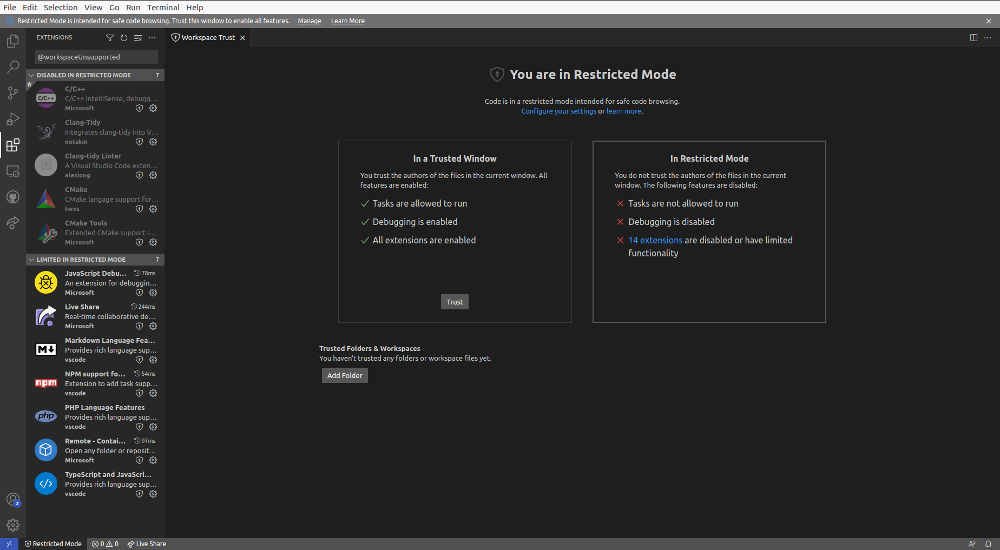
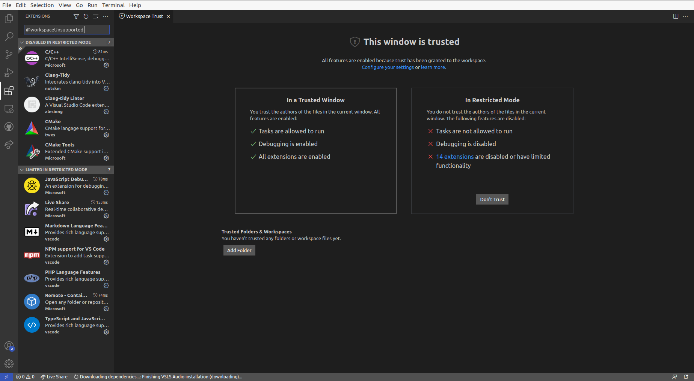

# bash-install-vscode
Bash scripts to install Visual Studio Code and set up CMake on Ubuntu

## Install

1. Download this repository onto your local machine. 
2. Open your terminal and navigate to where the repository is with `cd path/to/repo/bash-install-vscode`
3. Make sure the file `install_vscode.sh` is executable with `ls -al`. `x` should indicate execute mode. If not, make the file executable with `chmod +x install_vscode.sh`. 
4. Execute bash file with `source install_vscode.sh`. You'll need admin rights and will be prompted for your password if not in root.

## Restricted mode

It might be that upon opening Visual Studio Code, some of the installed extensions are disabled. This is because you are using VS code in **restricted mode**. 

From the Visual Studio Code documentation on Workspace Trust:

> Restricted Mode tries to prevent automatic code execution by disabling or limiting the operation of several VS Code features: tasks, debugging, workspace settings, and extensions.

To view the list of disabled extensions, go to *Extensions* on the left-hand side menu (`Ctrl+Shift+X`), the search `@workspaceUnsupported`. 

You can circumvent this problem by selecting `Trust` in the central panel:

More information:

- [VS Code's Workspace Trust](https://code.visualstudio.com/docs/editor/workspace-trust)
- [Workaround & Manage Settings](https://stackoverflow.com/a/67940194)