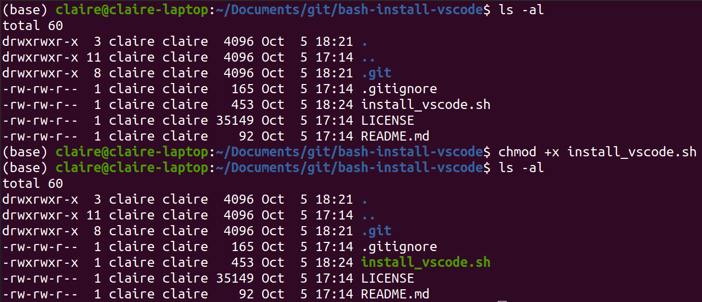

# bash-install-vscode
Bash scripts to install Visual Studio Code and set up CMake on Ubuntu

## Install

1. Download this repository onto your local machine. 
2. Open your terminal and navigate to where the repository is with `cd path/to/repo/bash-install-vscode`
3. Make sure the file `install_vscode.sh` is executable with `ls -al`. `x` should indicate execute mode. If not, make the file executable with `chmod +x install_vscode.sh`. 
4. Execute bash file in root with `sudo source install_vscode.sh`